  <a href="https://alexchih.com">
    <picture>
      <source media="(prefers-color-scheme: dark)" srcset="./assets/card-dark.svg">
      
    </picture>
  </a>

  <a href="https://alexchih.com"><b>Website</b></a> ·
  <a href="https://washiveil.alexchih.com"><b>washiveil</b></a> ·
  <a href="https://alexchih.com/speaking"><b>Speaking</b></a> ·
  <a href="https://www.linkedin.com/in/alexchih"><b>LinkedIn</b></a> ·
  <a href="mailto:hi@alexchih.com"><b>hi@alexchih.com</b></a>

---

Platform & Security Engineer at [Spuree](https://spuree.com), an AI animation startup —
product and platform in one seat, with security as the through-line. Before that:
DevOps at ViewSonic, and security solutions architecture at eCloudvalley.

I also teach. Microsoft Certified Trainer, cloud security workshops in zh-TW and
English, and I built the eCloudture eLearning platform.

- **Now** — cloud infrastructure and platform security at Spuree
- **Working with** — AWS, Azure, Kubernetes, GitOps, Terraform, AWS CDK
- **Open for** — talks, training, and workshops · [hi@alexchih.com](mailto:hi@alexchih.com)
