  <picture>
    <source media="(prefers-color-scheme: dark)" srcset="./assets/hero-dark.svg">
    
  </picture>

  <a href="https://alexchih.com"><picture><source media="(prefers-color-scheme: dark)" srcset="./assets/action-site-dark.svg"></picture></a>
  <a href="https://www.linkedin.com/in/alexchih"><picture><source media="(prefers-color-scheme: dark)" srcset="./assets/action-linkedin-dark.svg"></picture></a>
  <a href="mailto:hi@alexchih.com"><picture><source media="(prefers-color-scheme: dark)" srcset="./assets/action-email-dark.svg"></picture></a>

  <a href="https://washiveil.alexchih.com">
    <picture>
      <source media="(prefers-color-scheme: dark)" srcset="./assets/washiveil-dark.svg">
      
    </picture>
  </a>

  <a href="https://alexchih.com/speaking">
    <picture>
      <source media="(prefers-color-scheme: dark)" srcset="./assets/speaking-dark.svg">
      
    </picture>
  </a>

---

Platform & Security Engineer at [Spuree](https://spuree.com), an AI animation startup —
product and platform in one seat, with security as the through-line. Before that:
DevOps at ViewSonic, and security solutions architecture at eCloudvalley.

I also teach. Microsoft Certified Trainer, cloud security workshops in zh-TW and
English, and I built the eCloudture eLearning platform.

- **Now** — cloud infrastructure and platform security at Spuree
- **Working with** — AWS, Azure, Kubernetes, GitOps, Terraform, AWS CDK
- **Open for** — talks, training, and workshops · [hi@alexchih.com](mailto:hi@alexchih.com)

**[washiveil](https://github.com/tochny/washiveil)** is the current side project — a
shadcn component registry built on a warm washi ground, three ambient lights, and
Chinese/Japanese typography treated as a first-class concern rather than a fallback.
Everything above is rendered in it: hand-authored SVG, two token layers, light and
dark, no third-party badge services.

Older repos here are archived experiments from 2021–2024 — CloudFormation
templates, CDK constructs, an Arduino-on-PIC implementation. Kept for the record,
not under maintenance.
